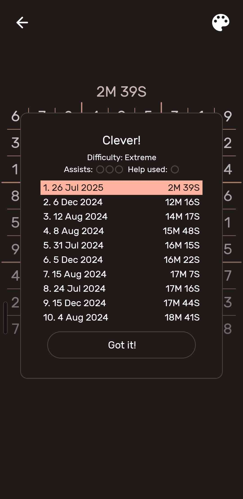

# Project info

## Info

This project was created to challenge myself, to expand my creative thinking in coding problems. The idea sparked from me getting pissed at extreme level sudokus frying my brain, so 2 birds with 1 stone.

## Guide

The project is pretty self-explanatory. When running the [main](main.py) file, the program asks you to enter each row on the unsolved sudoku board, starting from the top row and moving down.

> [!Important]
> Empty cells have to be marked with a 0!

## Showcase

Using this program I solved an extreme level sudoku in 2 minutes and 39 seconds, which includes the time it took me to write the unsolved board from my phone to the program, then the solved board from the program back to my phone.